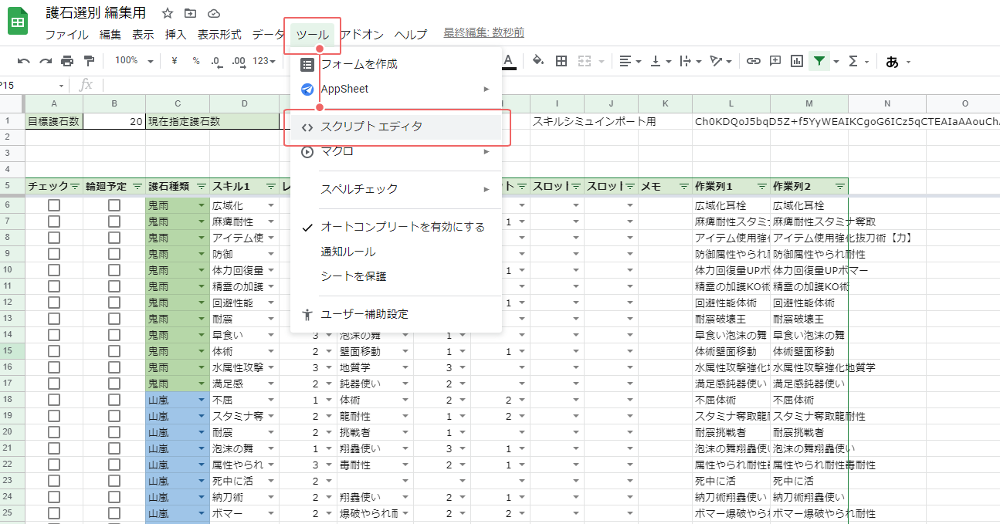
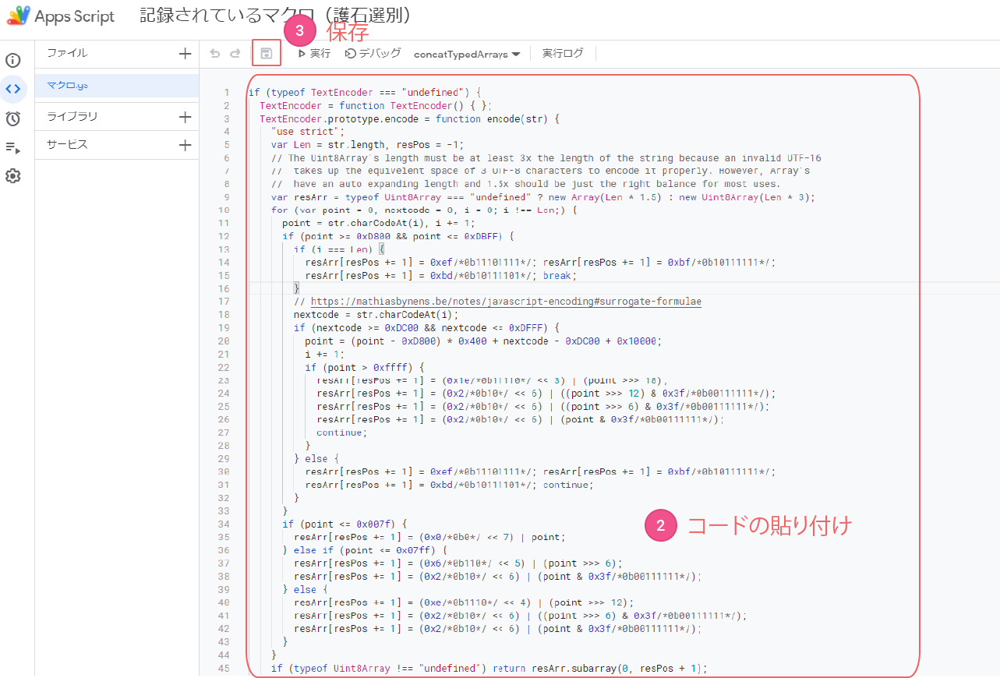
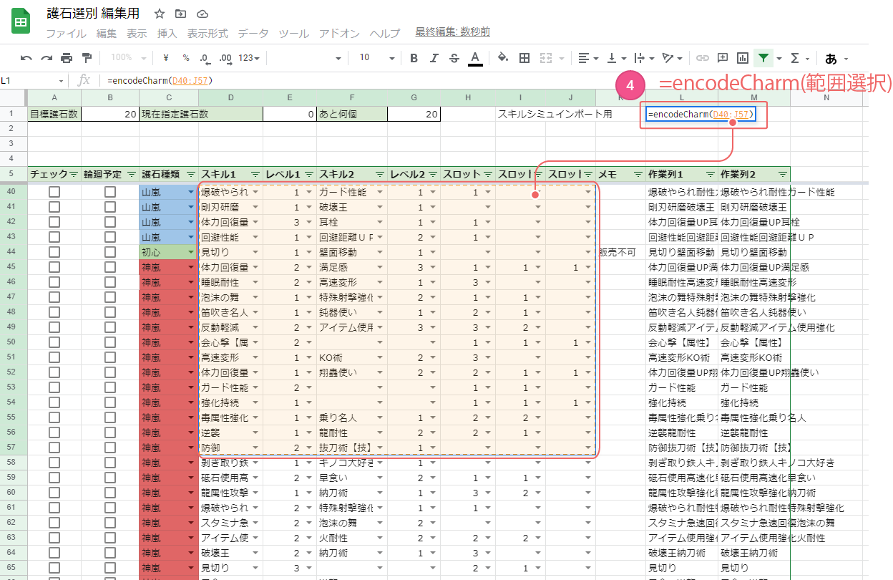
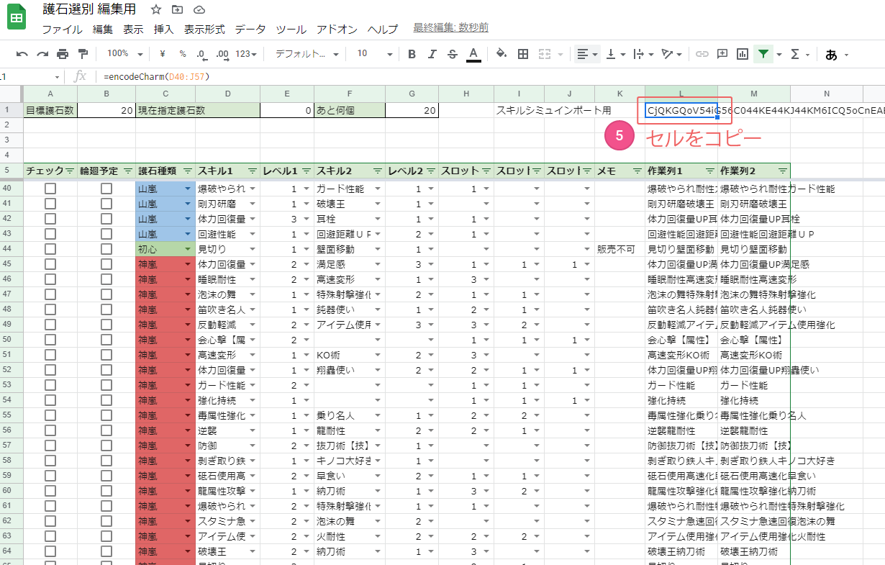
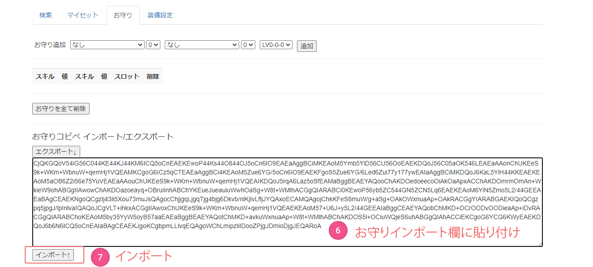

## MHRiseスキルシミュ用インポートデータ作成

このコードはGoogleスプレッドシートで作成したMHRiseのお守りを
[MHRise スキルシミュ(泣)](https://mhrise.wiki-db.com/sim/)へインポート可能な文字列に変換するものです。

### 準備
Googleスプレッドシートでお守りのデータを作成します。
形式は下記の通りです。
文字列がスキルシミュと異なると正しくインポートできません。
スキルの一覧は[SkillList.txt](SkillList.txt)にあります。

|  スキル1 |  スキル1レベル  |  スキル2  |  スキル2レベル  |  スロット1レベル  |  スロット2レベル  |  スロット3レベル  |
|  ----  |  ----  |  ----  |  ----  |  ----  |  ----  |  ----  |
|  ＫＯ術  |  1  |  アイテム使用強化  |  2  |  2  |  1  |    |

[Googleスプレッドシートサンプル](https://docs.google.com/spreadsheets/d/1GFYHuL73JQyoY7YAR13-pgouNokNMIyvHs9JdVja7kU/edit?usp=sharing)

### 手順

1. Googleスプレッドシートのツールからスクリプトエディタを選択します。

2. [スクリプト](CharmExporter.gs)から内容をコピーし、スクリプトエディタ内に貼り付けます。
3. スクリプトエディタ上部にある保存マークをクリックします。

4. Googleスプレッドシートに戻って適当なセルをダブルクリックし=encodeCharm(範囲をマウスで選択)と入力しEnterで決定します。

5. 計算後に出てきた文字列をコピーします。

6. スキルシミュのお守りインポート欄に入力し、インポートボタンを押します。

※うまく入力されない場合はスキル名がスキルシミュと完全に一致していません。ＫＯ術などの英語は全角英語で入力するなど間違いが無いか確認してください。
うまく入力出来なかった時は削除ボタンで削除してください。

### 他の言語で実装したい方へ

もし実装した後、公開するならば、[スキルシミュのFAQ](https://mhrise.wiki-db.com/simfaq) のコメント欄で作者の方に公開の許可を取ってください。※私は作者ではないですが、許可は取るべきです。

大まかな情報は[DataFormat.md](DataFormat.md) に書いてあります。質問はIssueに書いてください。
